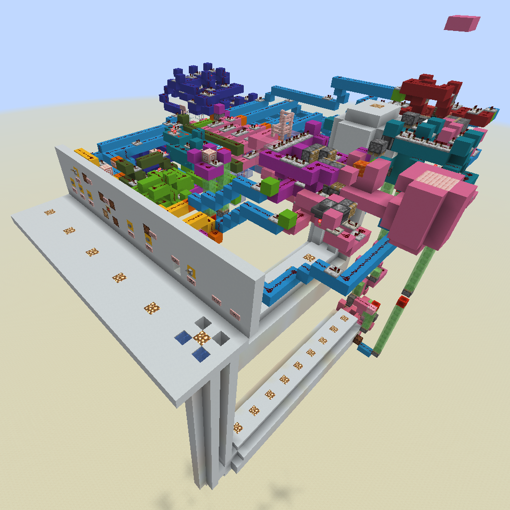
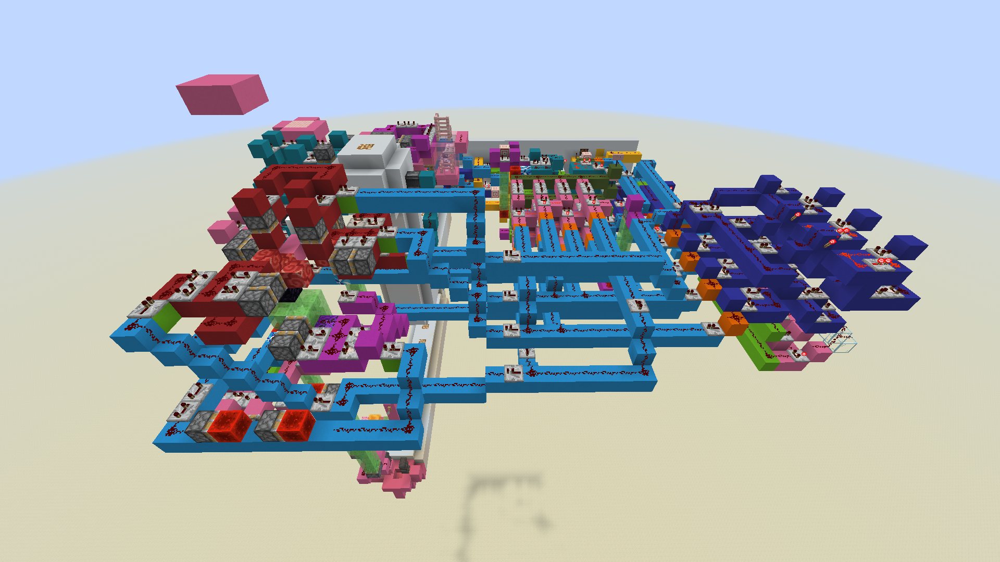
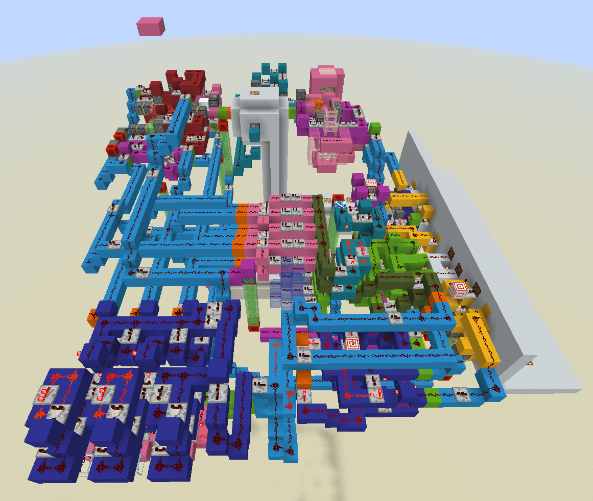
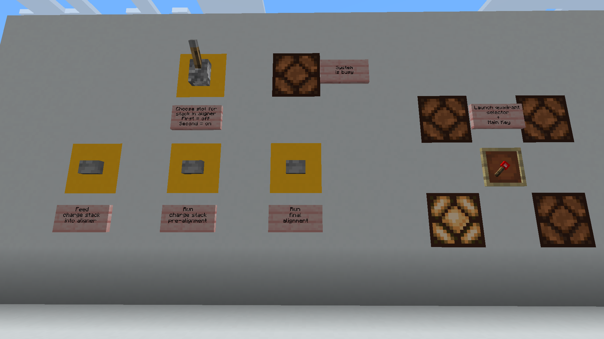
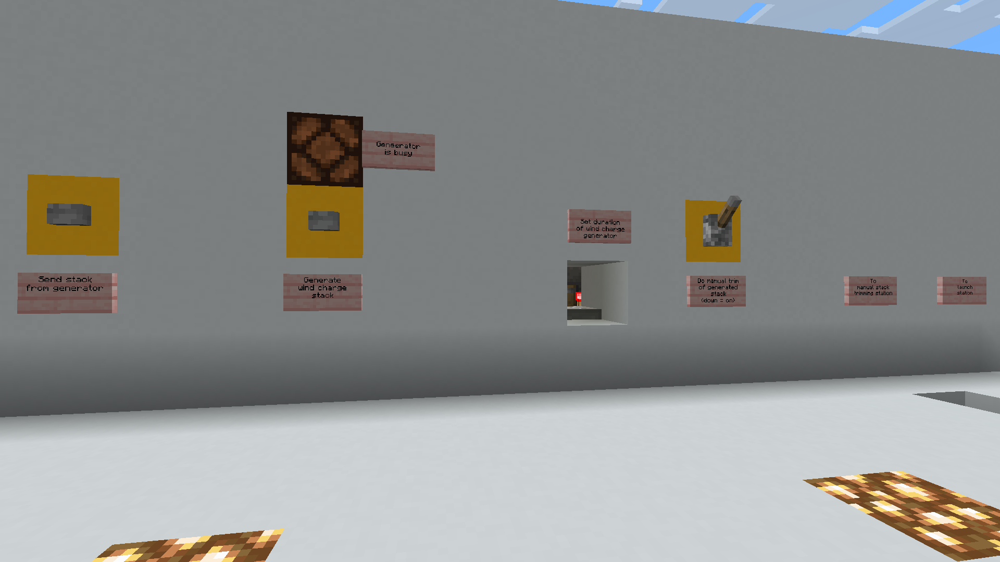
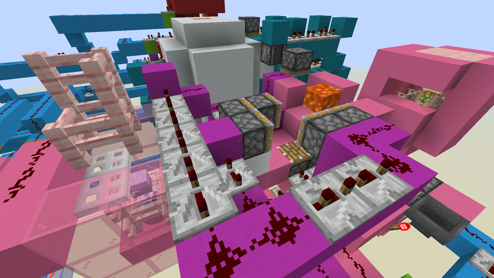

# Minecraft 360 degree wind charge pearl cannon

  

  

## Overview

This project contains a Minecraft build of semi-automated, omnidirectional, breeze powered ender pearl cannon. 

Additionally, a ballistic calculator is written in Python. It converts data about cannon and target into a firing solution. See manual in Calculator folder.

Key features:
- Any firing angle
- Unlimited distance (limited by game resources)
- Semi-automated operation
- Works in Overworld and Nether, no modifications required
- Fits inside 44x44x44 cube
- Tested in 1.21.8-1.21.10 Vanilla and on local 1.21.8 Paper server

Limitations / things to optimize:
- Wind charge generator is optimized for speed and reusability over precision. It can be replaced with one of existing precise single breeze designs or with breeze charge item dispencers. Execution is left as an exercise for the reader
- Very long distance travel takes progressively more time due to slight upward pearl velocity. Improvement will require very fine adjustments to trajectory of bouncing pearl

## Building cannon

Folder Schematics contains Litematica build file of cannon. To access it in-game, move file into "schematics" folder of your Minecraft instance.

## Principle of operation

Cannon operation can be divided into 2 stages - charge preparation, and firing. 

Charge preparation results in 1-2 wind charge stacks occupying specific locations in aligner module. 4 locations are used, forming a skewed '+' sign within 2x2 area. Choice of stack locations determines firing direction, and their size ratio determines angle.

The firing is done by launching the ender pearl and charge stacks vertically up into 2x2 slab of blocks. A configuration was found that places pearl only slightly above charge explosion center, resulting in nearly horizontal velocity. More exact numbers can be found in "cannonConstants.py" file.

## Operating instruction

Prerequisites: 
- Cannon must be built above obstacles
- 1-24 breezes must be nametagged and put into wind charge generator (into fenced cage)
- Iron golem must be created and put into wind charge generator
- An item (e.g. redstone torch) must be present in item frame to fully unlock controls

Action sequence:
1) Look at block behind item frame, in F3 read its coordinate and player's facing direction
2) Input coordinate and facing direction into calculator to get firing solution
3) Use item frame to select required quadrant from solution
4) Choose manual trim via "Do manual trim" lever. It can be disabled if precision is not important
5) Start generating first stack from solution - load items into hopper to set generator working time (and thus size of charge stack)
6) Press "Generate wind charge stack" button, wait for lamp above button to turn off
7) Press "Send stack from generator" button to collect and send the stack
8) If manual trim is active, go to manual trimming station. If not, skip to step 11
9) In manual trimming station, look at charge stack with F3 to get entity count. Move camera around to exclude mobs
10) Punch out wind charges to get exact stack size. Interact with noteblock to send charges away
11) If more charges for the same stack are required, go to step 5
12) Press "Feed charge stack into aligner" button to prepare stack for alignment
13) Use lever to select first slot for charge stack (off state / pointing up)
14) Press "Run charge stack pre-alignment" button, wait for busy indicator
15) Repeat steps 5..14 for second stack from solution, but set lever in step 13 to second slot (on state / pointing down)
16) Run final alignment, wait for busy indicator
17) Go to launch station
18) Throw ender pearl vertically up, wait for it to bounce at least once (listen for piston sounds)
19) Press Fire button, which launches pearl and charges upwards
20) Wait for pearl to land

## Parts explained

### UI panel
Colored white. Has all control elements to prepare charge stacks for launch. Controls get locked if item frame is empty, or when an operation is ongoing (such as alignments). There is a "System is busy" lamp to indicate when controls are locked.

### Wind charge generator
Colored pink. Uses trapped breezes to generate wind charges. Breezes must be nametagged and loaded into cage, and iron golem must be created. Accumulation time is controlled by hopper clock. Collected charges are combined into stack and sent out on signal from button. 
Main drawback of generator is an imprecise stack size, because breezes fire randomly. Single breeze design can be precisely controlled (see [Hectoris919](https://www.youtube.com/watch?v=So3EAnSgX7o) on YouTube), but was not used in favor of speed. Solution to low precisin is the Manual trim station.

An approximate formula to get item count from charge stack size was experimentally derived (using 10 breezes):  
$y = \dfrac{x}{0.175 * N} + {5.5}$,  
where y is hopper item count, x is wind charge stack size, N is amount of breezes in generator.  
Recommended way is to go slightly above and trim down manually.

Related UI controls:
- Item hopper - part of hopperclock, must be loaded with items to set generator working time. Current design needs to tick down to fully recharge, user can help by manually transfering items from left hopper to right.
- "Generate wind charge stack" button - starts hopperclock, allows breezes to fire. Lamp was added to indicate end of process.
- "Send stack from generator" button - gathers frozen wind charges into a single stack, sends it out of generator with small speed.

### Manual trim station
Colored white. Accessed via tunnel. Only gets used if "Do manual trim" lever is active. User must use F3 Visible Entity counter (first number after "E:") to get stack size. It is recommended to look around to reject background entities, and look a bit to the left to exclude iron golem. Trimming is done by punching out individual wind charges. When done, interact with note block to send off stack.

### Charge alignment & launching mechanism
Colored red. Uses pistons to align wind charge stacks inside 2x2 working area. During firing launches them into 2x2 pink plate with slime blocks. 

Pre-alignment moves 1st and 2nd stack into their own corner. Final alignment moves both to near-middle of faces. Thus 4 valid stack positions form an angled '+' shape around center, with at most 2 being populated to give correct pearl velocity via vector addition.

Related UI controls:
- Quadrant selector - selector for firing quadrant. Must be set once in the beginning, serves to select correct alignment sequence
- "Feed stack into aligner" button - pushes charge stack from staging area into working area
- "Choose slot for stack in aligner" lever - selects pre-alignment position to move charge stack into. "Off" means first stack, "On" means last stack
- "Run stack pre-alignment" button - moves charge stack from start of working area into required corner
- "Run final alignment" button - must be pressed once both stacks are pre-aligned. Moves them into middle of faces

### Ender pearl aligner
Colored pink. Accessed via tunnel. Aligns and stores an ender pearl from user, releases it on trigger. Mantains precise timings for second pearl bounce and signal to push wind charges. There might be a small random chance of pearl failing to bounce and falling back down. 

User must get into designated area and launch ender pearl vertically up. Pearl gets trapped and bounces on slime block. Pearl trajectory stabilizes after 2nd bounce, user must wait for periodic piston sound. Then user must press "Fire" button. This launches pearl higher up and triggers launch of stored charge stacks.

### Misc redstone logic
Composed of many colored parts in the left half of build. Handles correct signal sequencing and timing for charge stack alignment. 

### Interconnects
Colored light blue to tell apart individual modules. 

## Contact info

If you have any questions, you can contact me at max.etching316@passinbox.com.

## License

This work is dedicated to the public domain via CC0 (Creative Commons Zero).  
While not required, please provide credit (to "mor_doc") when using this work.

